# **Git**

[TOC]

為了因應Bitbucket即將停止hg的服務，是時候要來惡補git了。

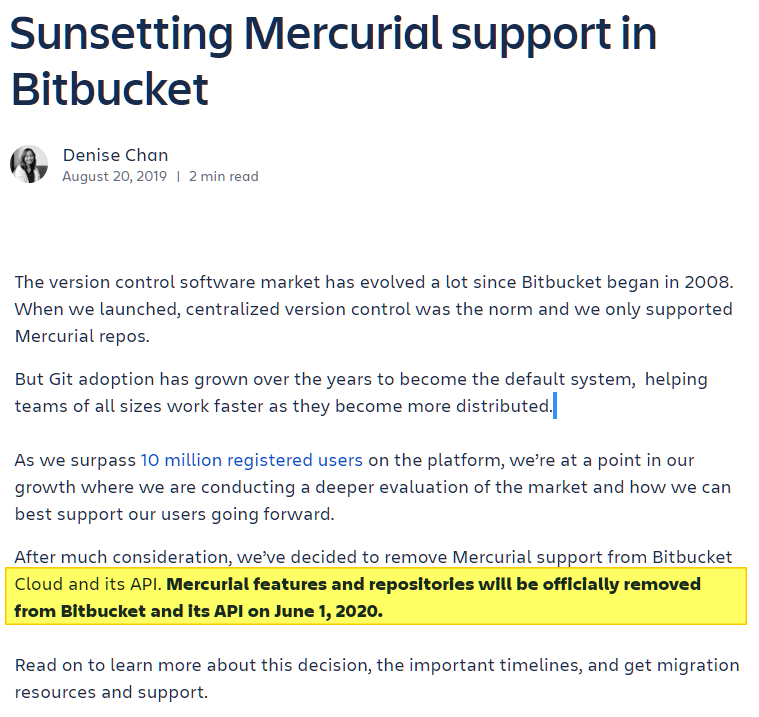

 https://bitbucket.org/blog/sunsetting-mercurial-support-in-bitbucket 

## **幾個Git GUI**

---

有些人說「**使用Git GUI會自取毀滅，我們推崇CLI**」。其實這只是打檔車與自排車的問題。檔車(CLI)還是比自排車(GUI)炫砲多了不是嗎？

使用GUI快速學會Git的精神後，抽個空去學(CLI)Command Line如何操作Git吧！

---

我故意不選擇畫面太陽春的GUI，至於甚麼叫做陽春例如：

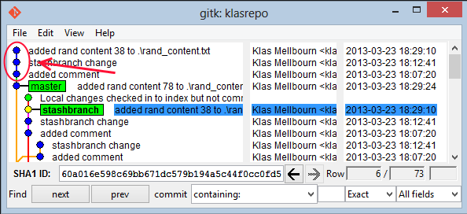

---

下列這幾個Git GUI，畫面比較豐富：

*Sourcetree*

 https://www.sourcetreeapp.com/ 

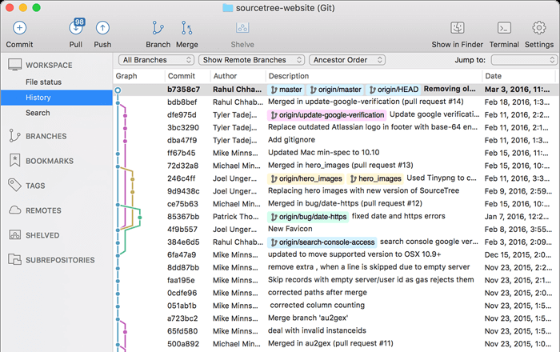

*TortoiseGit*

 https://tortoisegit.org/about/ 

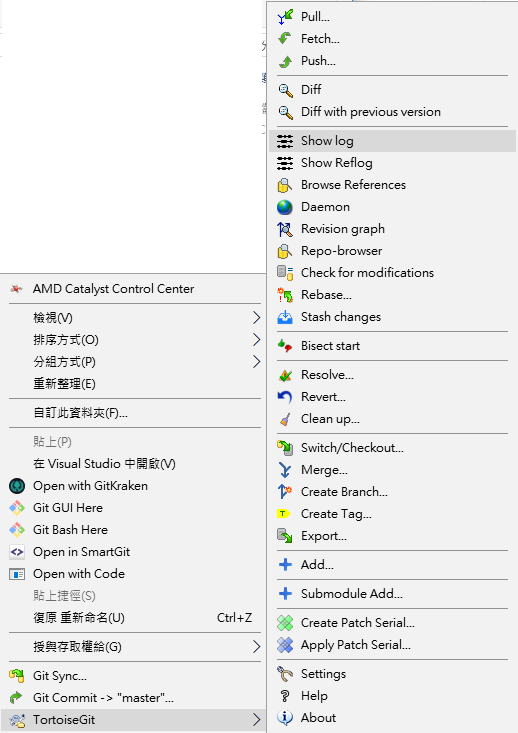

*SmartGit*

 https://www.syntevo.com/smartgit/ 

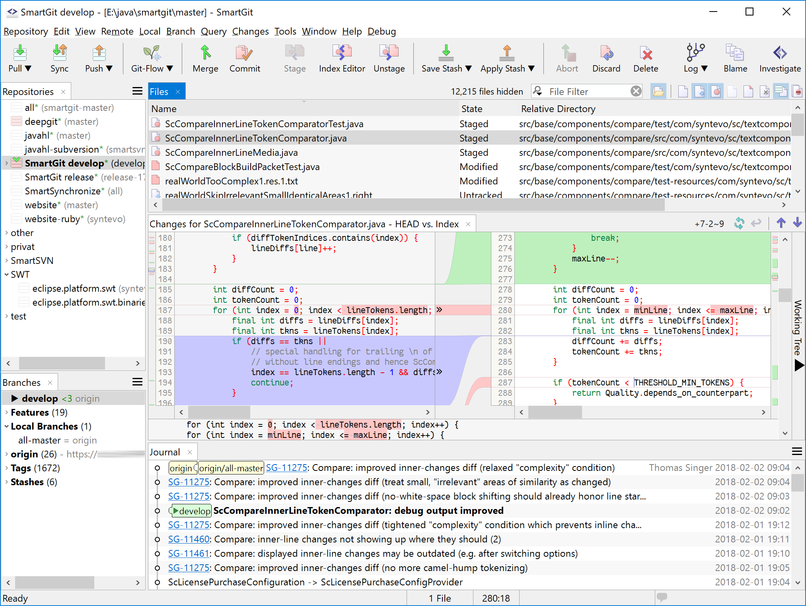

*GitKraken*

 https://www.gitkraken.com/ 

   

----

## **初始化git版本庫的方法**

### **終端機**

```powershell
git init
```

### **Sourcetree**

打開SourceTree>工具列 > File > Clone/New > Create >選擇要初始化的資料夾 > Create

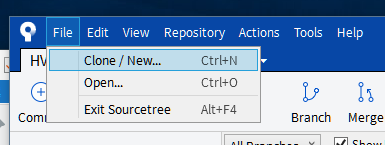

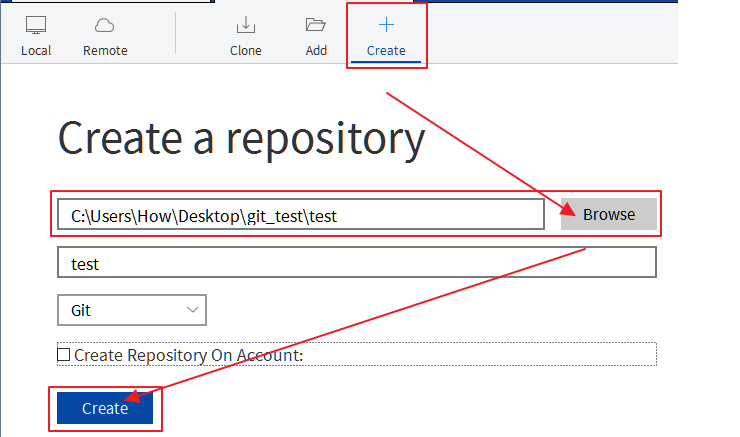

----

### **TortoiseGit**

對資料夾按右鍵選擇即可

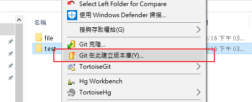

----

### **SmartGit**

打開SmartGit > 工具列 > Respository > 選擇要初始化的資料夾 > Git

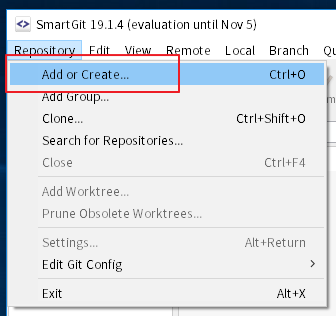

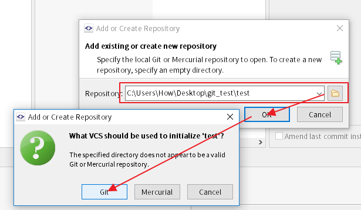

----

### **GitKraken**

Start a local repo

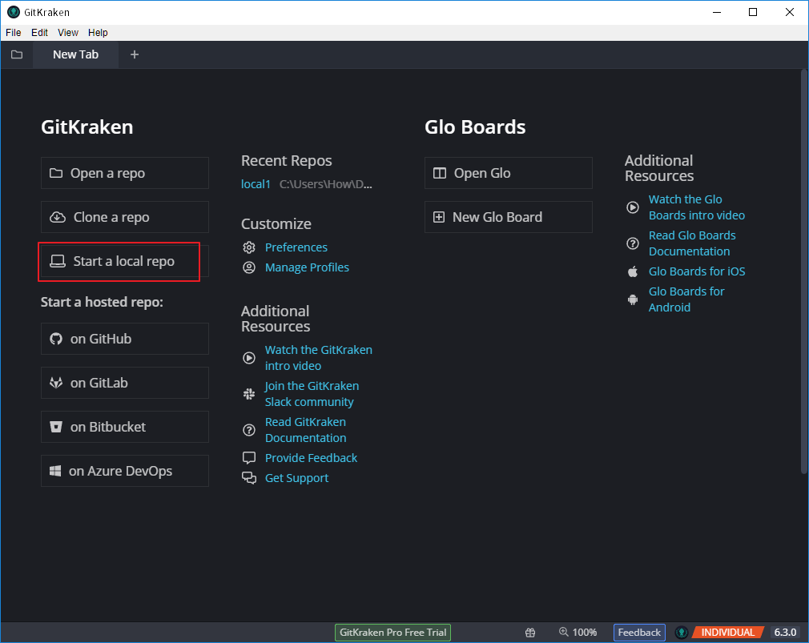

選擇要初始化的資料夾後點選Create Repository

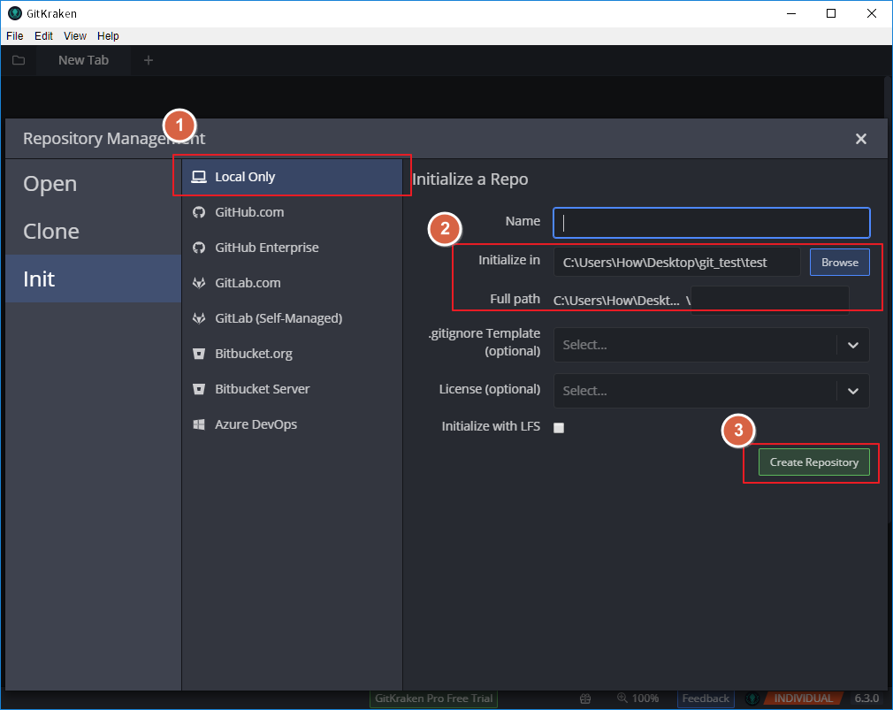

----
# [Next - Git提交](./Git_01_commit.md)
# [Home](./Home.md)

