# **Git提交**

[TOC]

## **Commit 提交 (存檔)** 

### **Sourcetree**

選擇要提交的檔案

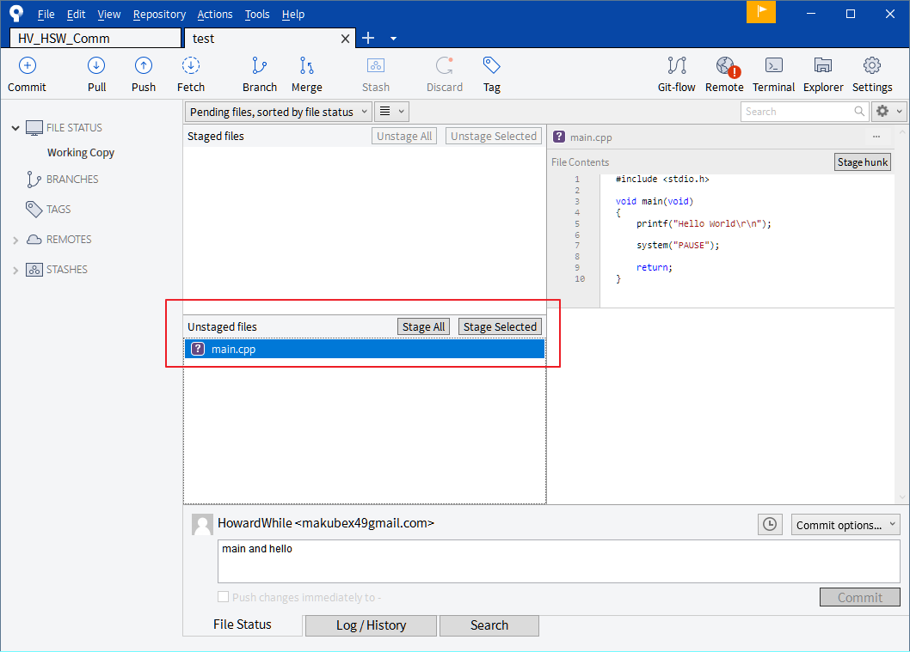

輸入提交的訊息點擊Commit

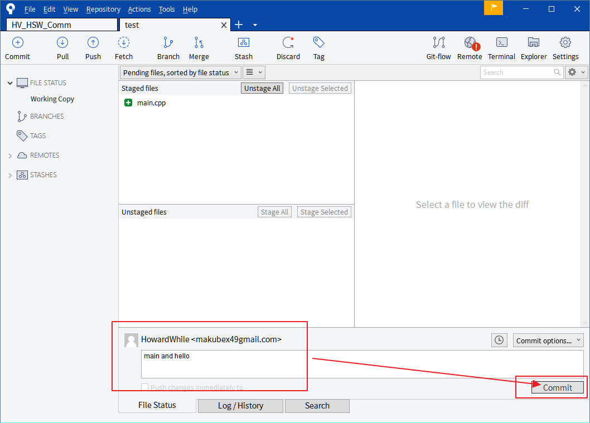

---

### **TortoiseGit**

在具有.git的資料夾中點選滑鼠右鍵

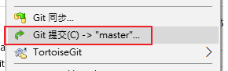

輸入提交的訊息點擊提交

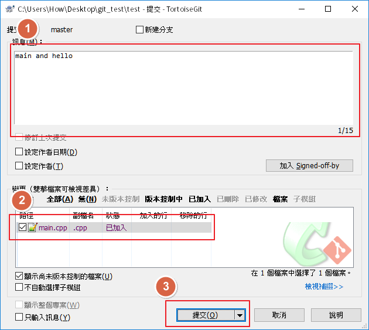

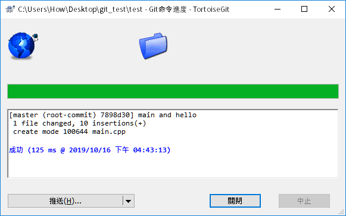

---

### **SmartGit**

選擇要提交的檔案再點選Commit開啟提交的視窗

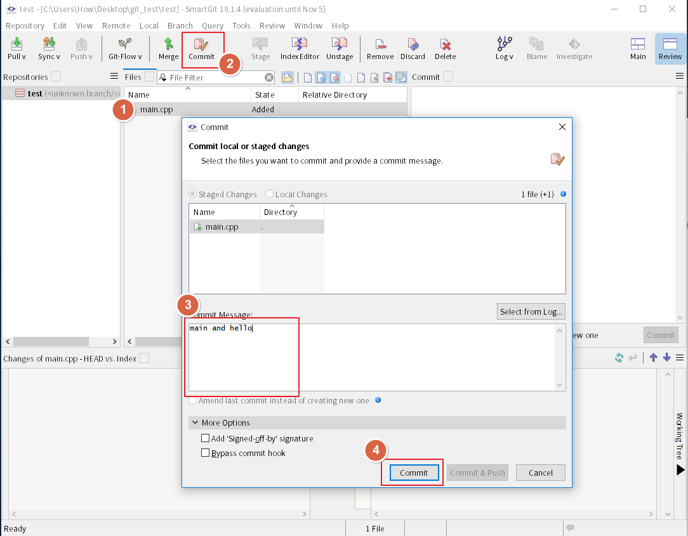

---

### **GitKraken**

選擇要提交的檔案

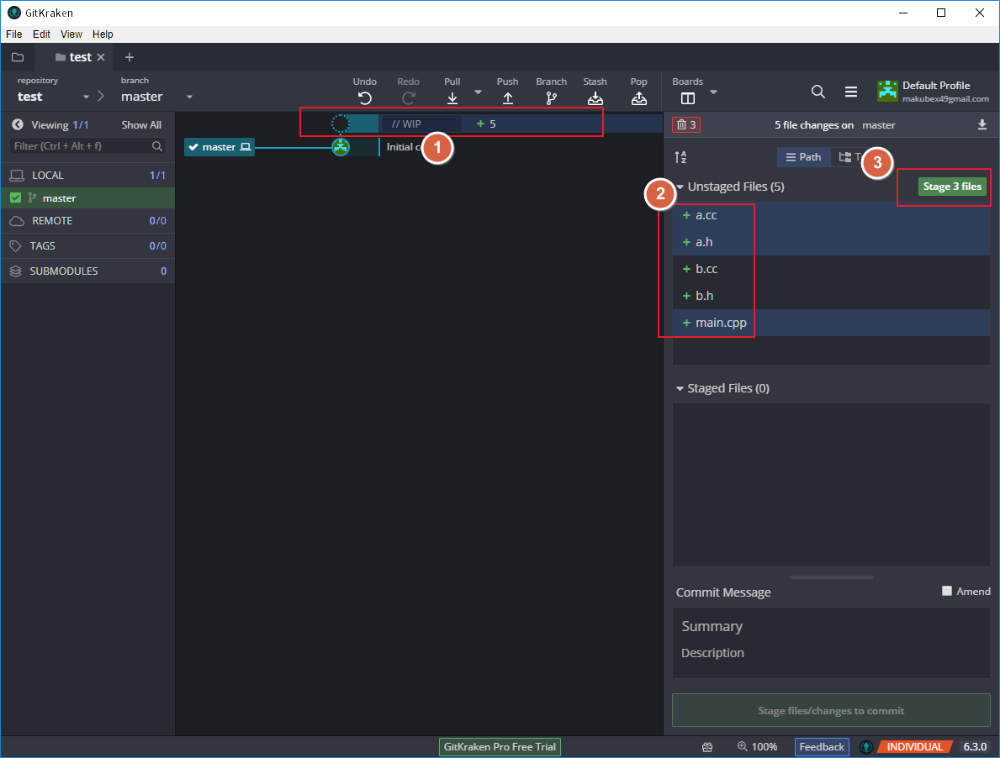

輸入提交訊息後提交

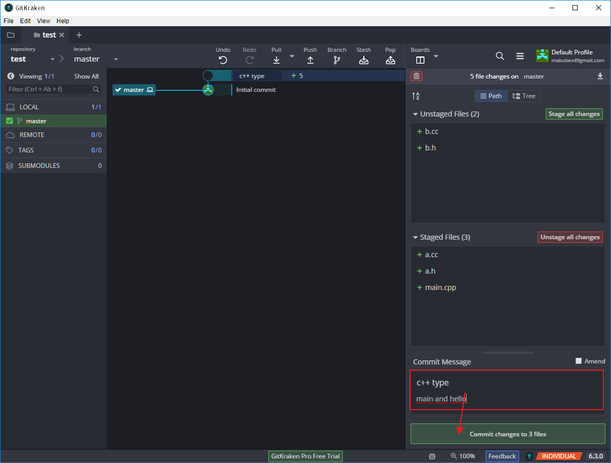
---
## **提交前觀案差異**
### **Sourcetree**

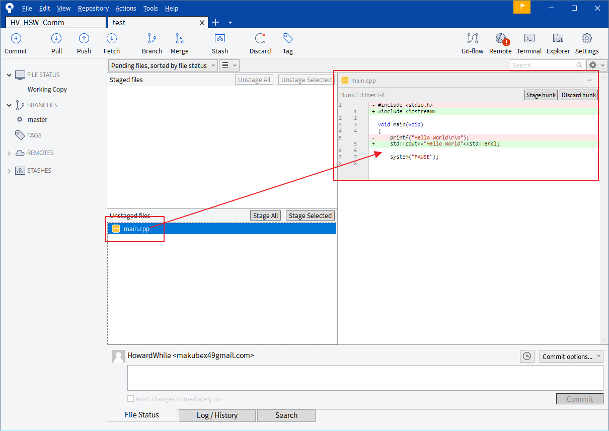

---

將diff設定成 Beyond Compare的方法

工具列 > Tools > Diff > External Diff / Merge

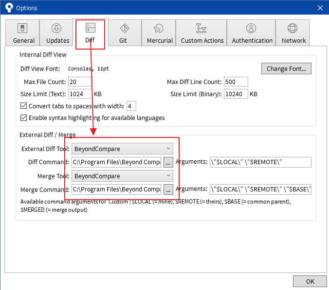

對要看差異的檔案點選右鍵選擇 External Diff

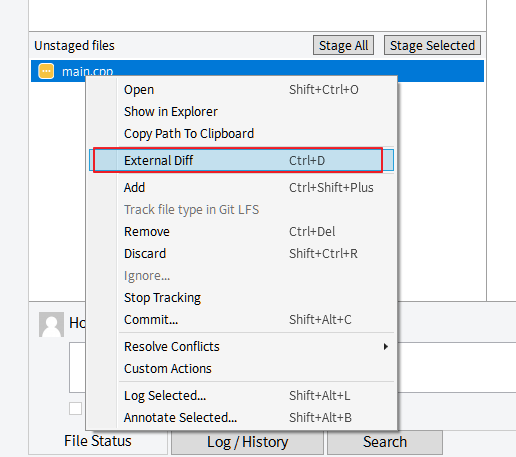

### **TortoiseGit**

直接對檔案點兩下即可

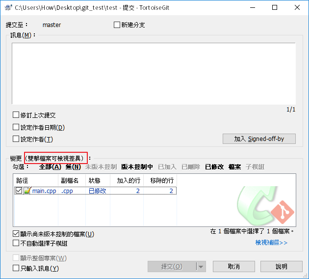

---

### **SmartGit**

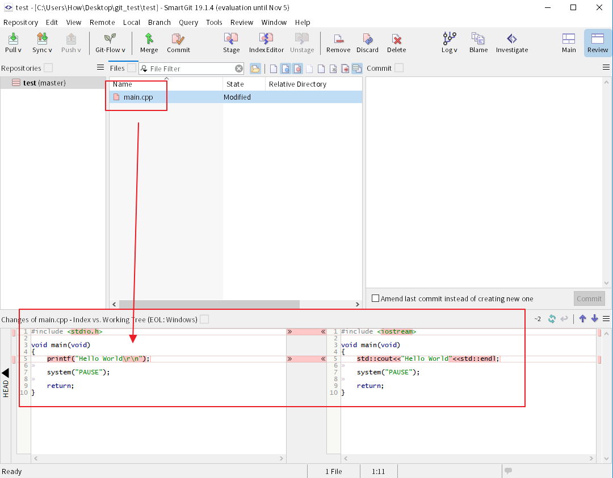

如果想使用Beyound Compare參考文章設置吧(有點麻煩...)

 https://blog.csdn.net/u010620626/article/details/78818687 

---

### **GitKraken**

直接點擊檔案就可以看到差異，右鍵選擇Open in external diff tool可以使用Beyond Compare看差異

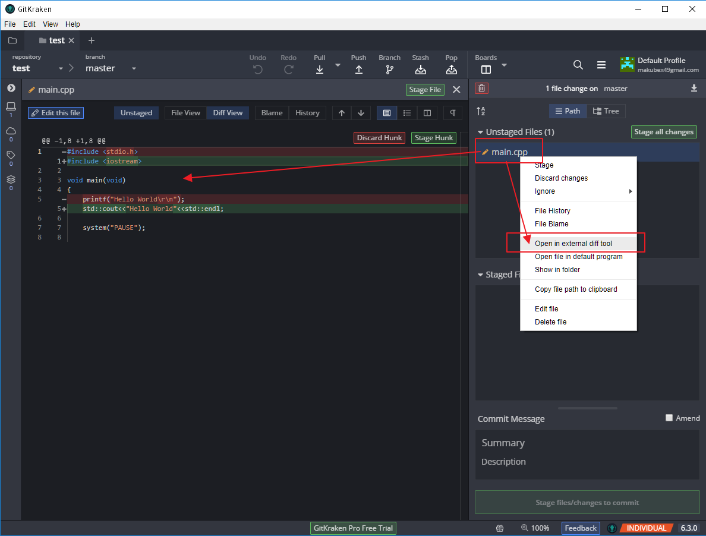

---

# [Next - Git版本切換](./Git_02_checkout.md)

# [Home](./Home.md)

