# **Git版本切換**

[TOC]

## **版本切換 (讀檔)**

版本跳躍在hg是**update**

但在git被稱為**checkout**或是**switch**

### **Sourcetree**

對要前往的版本點選擇checkout

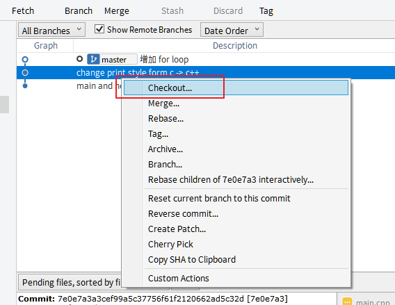

---

當前版本Graph欄位的圈圈會是中空的

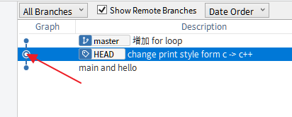

---

### **TortoiseGit**

資料夾按右鍵選擇show log，選擇Switch/Checkout也行但操作版本跳躍在commit選項時，不知道為甚麼特別卡

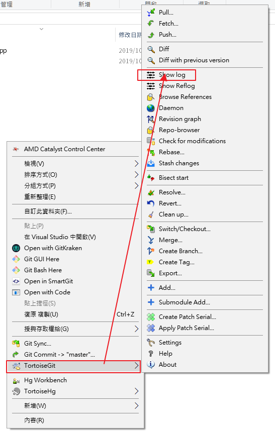

對要切換的版本點右鍵選擇Switch/Checkout to this

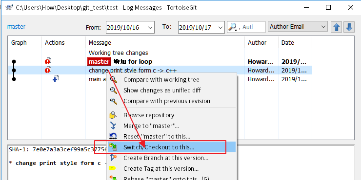

記得將Create New Branch勾掉不然會長一個分支出來

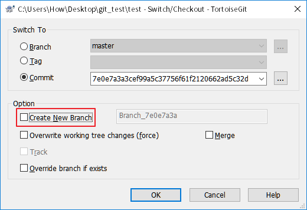

---

當前版本

Message欄位的字體會是粗體

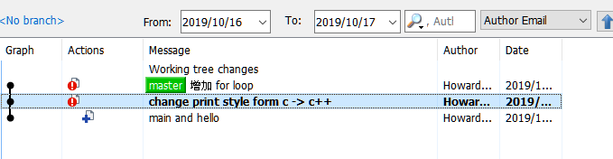

---

### **SmartGit**

先開啟Log v

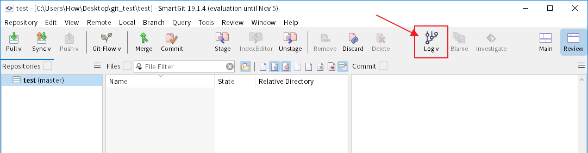

對要切換的版本點右鍵選擇Check Out...

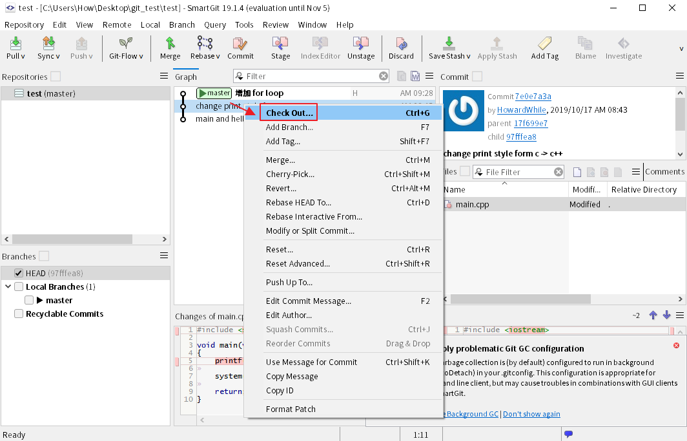

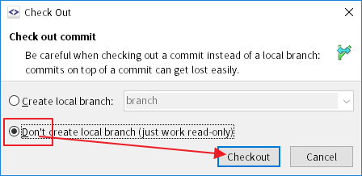

---

#### 有些版本不見了怎麼辦

到左下角把Local Branches勾起來就會顯示出來了

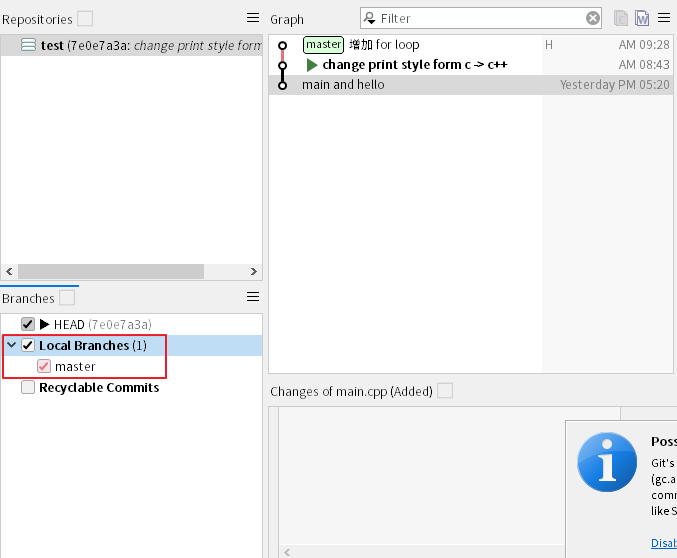

---

當前版本會有一個三角形箭頭顯示

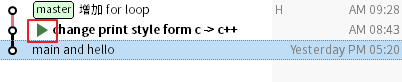

---

### **GitKraken**

對要切換的版本點右鍵選擇Checkout this commit

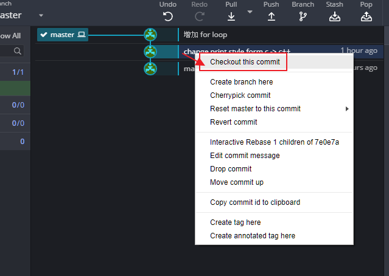

---

當前版本前面會有一條連線與勾勾

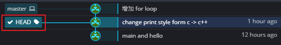

---
## **版本比較**
### **Sourcetree**

[ref](https://community.atlassian.com/t5/Bitbucket-questions/SourceTree-diff-between-two-commits/qaq-p/70248)

使用Ctrl+Click選擇兩個commit，就可以看到差異。

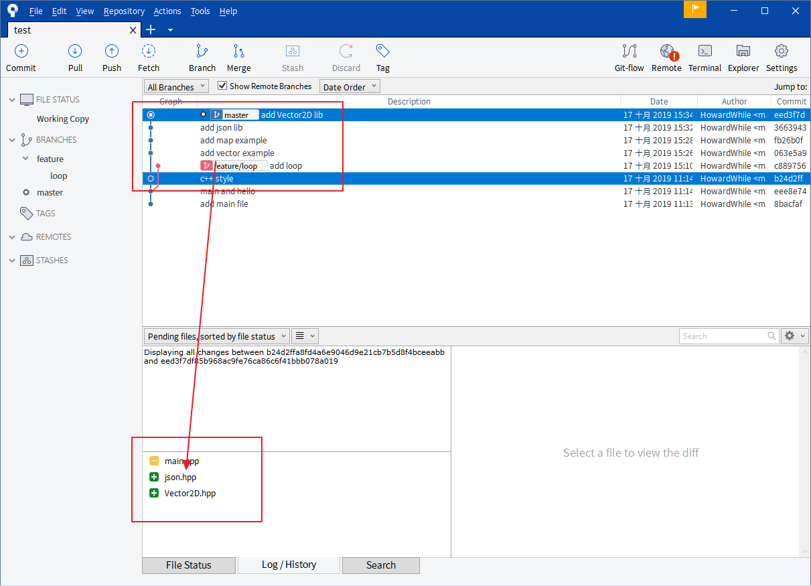

要看細節或使用外部的比較軟體可以這樣子做

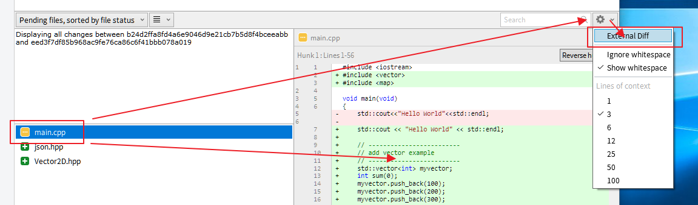

---

### **TortoiseGit**

右鍵顯示show log

在要比較的提交上點右鍵選擇 Compare with working tree，就會與當前版本(粗體)比較差異。

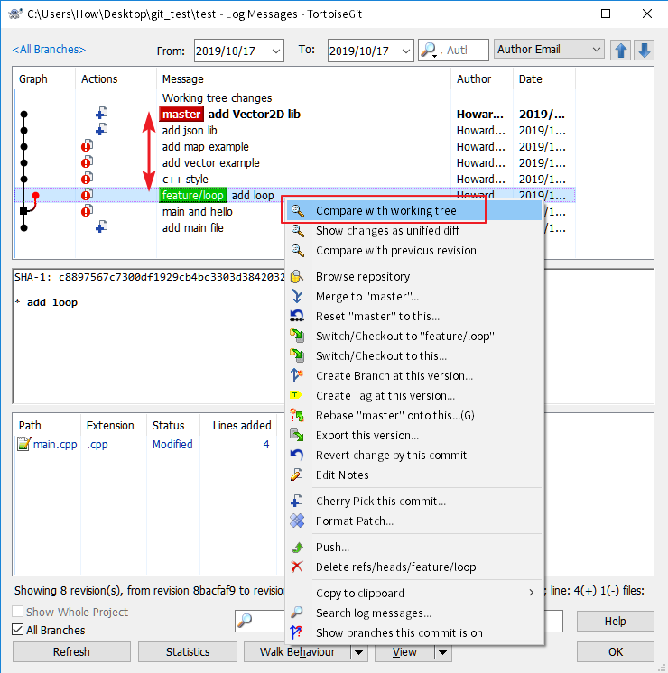

雙擊可以用比較軟體看細節

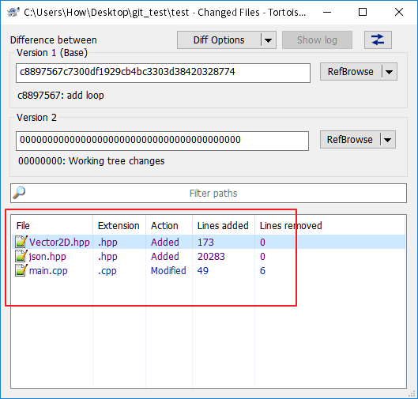

---

### **SmartGit**

先開啟Log v

使用Ctrl+Click選擇兩個commit，就可以看到差異。

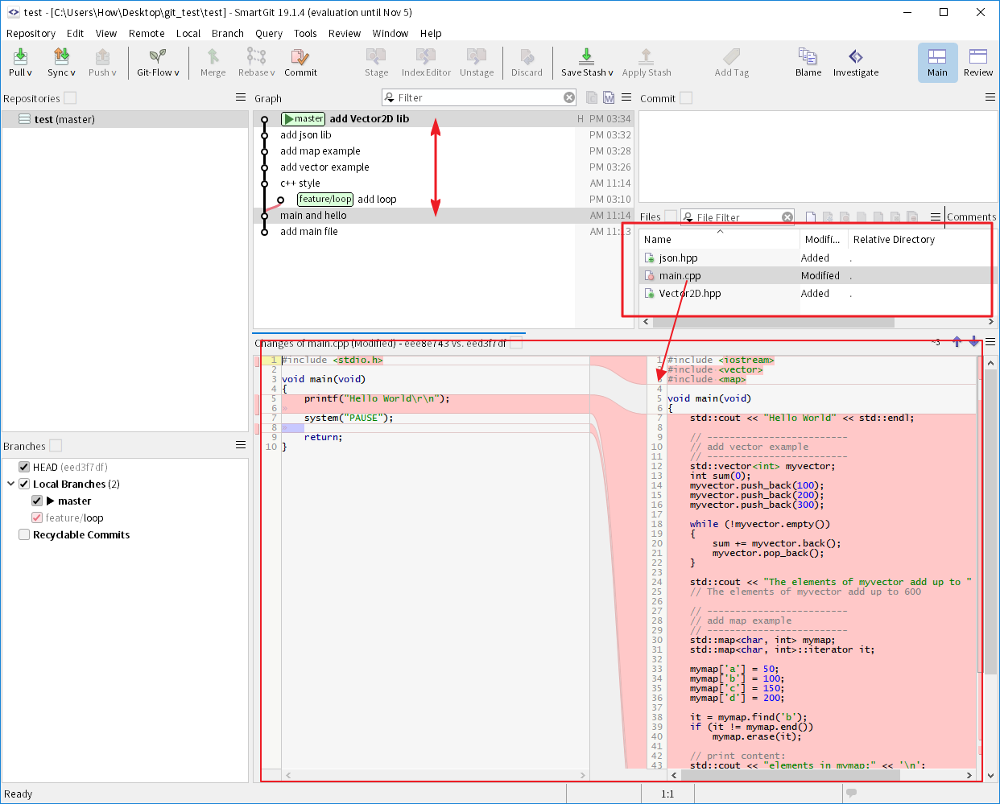

---

### **GitKraken**

使用Ctrl+Click選擇兩個commit，就可以看到差異。

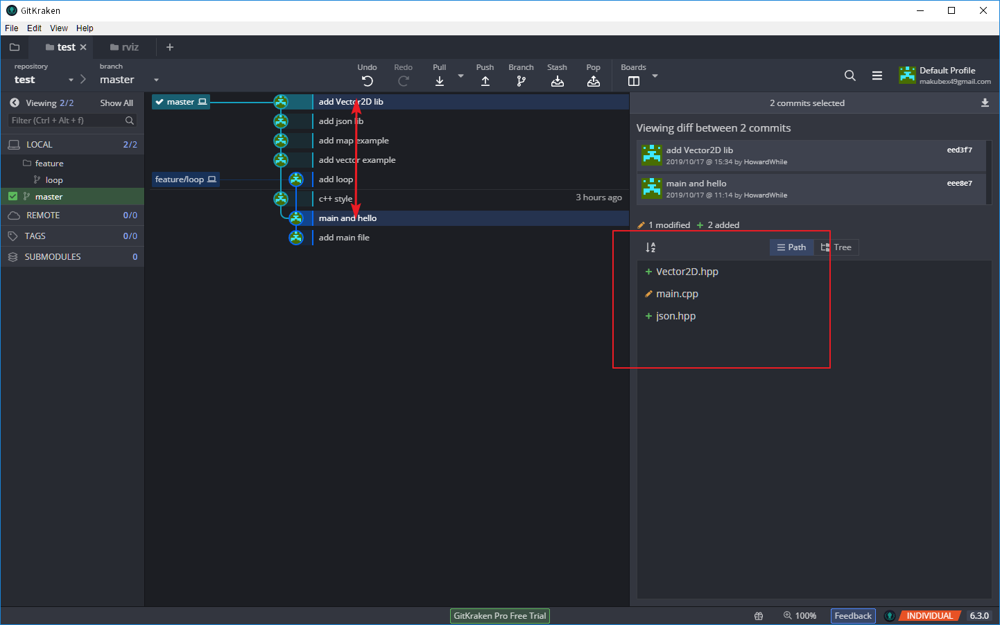

要看細節可以點右邊的檔案或按右鍵開啟外掛的比較軟體

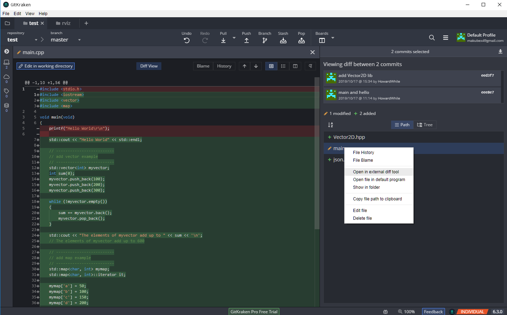

---

# [Next - Git多工](./Git_03_merge.md)

# [Home](./Home.md)

