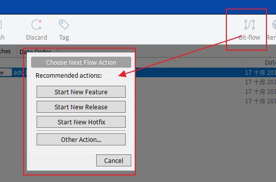
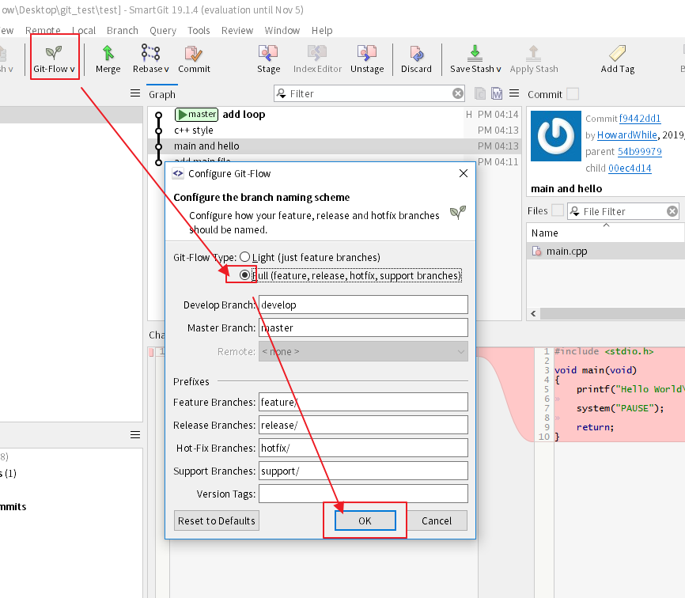
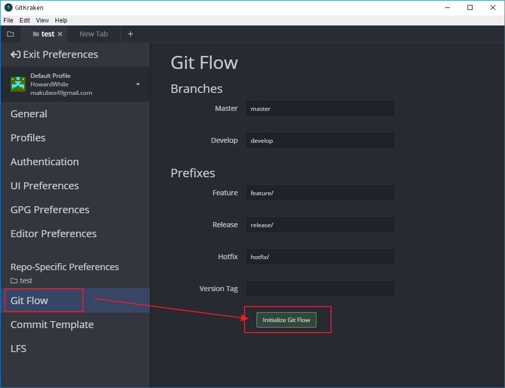
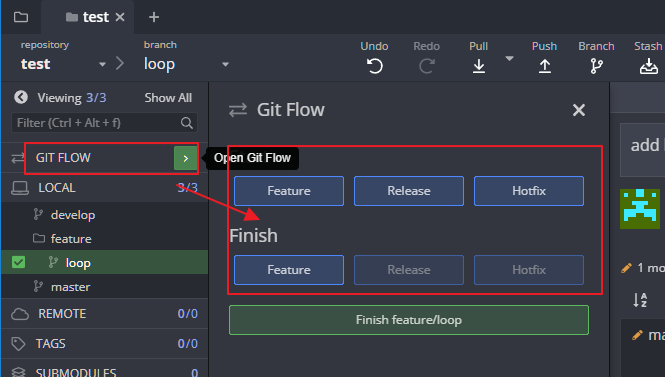

# **Git Flow**

[TOC]

 https://blog.csdn.net/stupid56862/article/details/80708811 

---

### **Sourcetree**

有支援git flow的分支工具，管理分支方便之後在細講

### **TortoiseGit**

沒有在TortoiseGit裡面找到git flow工具...要自行維護

### **SmartGit**

有內建Git flow的分支工具

---

### **GitKraken**

 https://www.youtube.com/watch?v=eTOgjQ9o4vQ 

從這三條線進去

或是工具列File>Preferences

啟用Git Flow的功能

就可以使用了

---

### **Sourcetree**

---

### **TortoiseGit**

---

### **SmartGit**

---

### **GitKraken**

---

# [Home](./Home.md)

