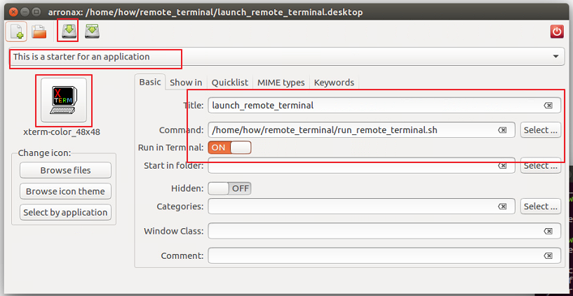
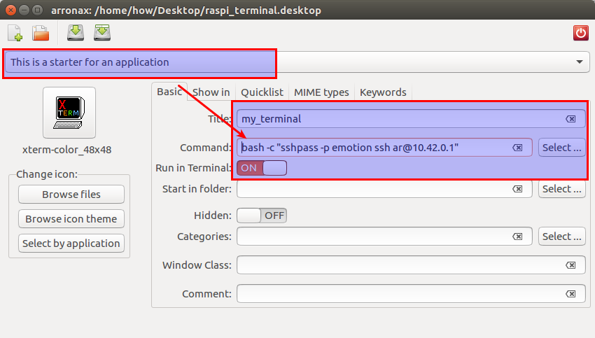

# Linux

### screen session

`screen` 指令是一般 UNIX/Linux 使用者或管理者常會使用的終端機管理程式，它可以讓一個終端機當成好幾個來使用

```sh
sudo apt install screen
```

#### 使用screen啟動批次檔

```shell
screen -dmS <NAME> path/to/shell.sh
```
#### 列出所有session

```shell
screen -list
```

#### 連接運行的session

```shell
screen -x <NAEM or Number>
```

#### 熱鍵跳出session不關閉

<kbd>CTRL</kbd>-<kbd>A</kbd> + <kbd>CTRL</kbd>-<kbd>D</kbd> 或 <kbd>CTRL</kbd>-<kbd>A</kbd> + <kbd>D</kbd> 

#### 關閉session

連入後<kbd>CTRL</kbd>-<kbd>C</kbd>

#### 關閉所有session

```shell
#!/bin/bash
screen -ls | grep Detached | cut -d. -f1 | awk '{print $1}' | xargs kill
read -n 1 -p "Press any key to continue..."
```


### ssh

#### 自動填入密碼

```shell
sudo apt-get install sshpass
sshpass -p your_password ssh user@hostname
```

如果想要登入後執行特定命令可以這樣子做

```shell
sshpass -p 密碼 ssh 使用者名稱@目標 '命令'
#ex:sshpass -p emotion ssh pi@192.168.1.85  '~/startup/kill_all_screen_sessions.sh'
```


#### 製作一個開啟遠端終端機的捷徑

方法一

```shell
mkdir remote_terminal
cd remote_terminal/

touch run_remote_terminal.sh

echo '#!/bin/bash' >> run_remote_terminal.sh
echo 'sshpass -p emotion ssh pi@10.42.0.1' >> run_remote_terminal.sh

chmod +x run_remote_terminal.sh
```

做個.desktop檔案

```shell
arronax
```




方法二(推薦)

需要兩個套件 `arronax` `sshpass`

先開啟終端機，確認自動填入密碼可以登入沒有錯誤訊息即可關閉

```shell
sshpass -p emotion ssh ar@10.42.0.1
```

使用`arronax`做出桌面檔案

在Command欄位輸入上方的命令加上使用bash執行

```shell
bash -c "sshpass -p emotion ssh ar@10.42.0.1"
```




### 在command line 重複執行某個命令

https://stackoverflow.com/questions/1289026/syntax-for-a-single-line-bash-infinite-while-loop

```shell
while true; do foo; sleep 2; done
```


# [Home](./Home.md)


