# Raspberry Pi

[TOC]


### 設定頁面

林林總總的設定，包含要不要開起圖形化桌面、攝影機到語言語系都可以到前往**Application menu-->Preferences-->Raspberry Pi Configuration**找找

如果要從終端機開啟設定頁面可以輸入

```shell
sudo raspi-config
```

### 遠端

- SSH

預設的Raspberry Pi沒有密碼，所以必須到**設定頁面**設定一組密碼才能連線。

- Teamview

可以到Teamview下載**Raspberry Pi專用的Teamview **不是linux的都可以用喔[https://www.teamviewer.com/en/download/linux/](https://www.teamviewer.com/en/download/linux/)

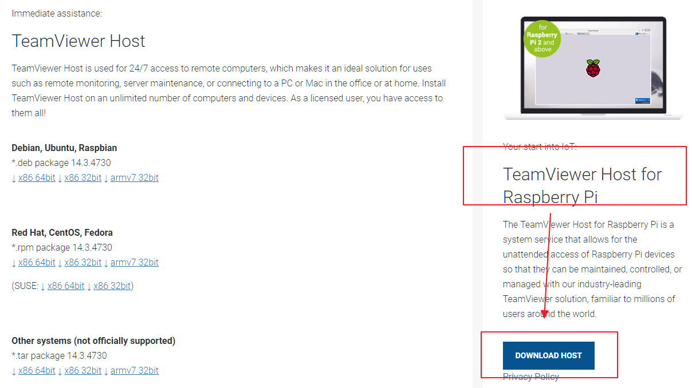

這樣設定就可以透過IP直接連入

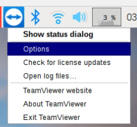


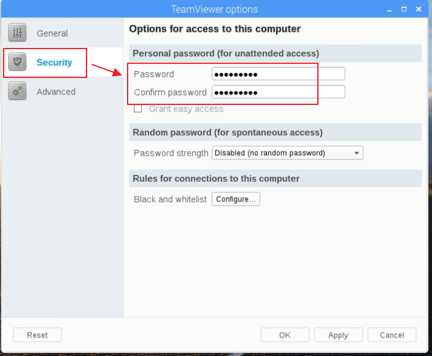

- AnyDesk

可以到AnyDesk下載**Raspberry Pi專用的安裝檔**

[https://anydesk.com/zhs/downloads/raspberry-pi](https://anydesk.com/zhs/downloads/raspberry-pi)

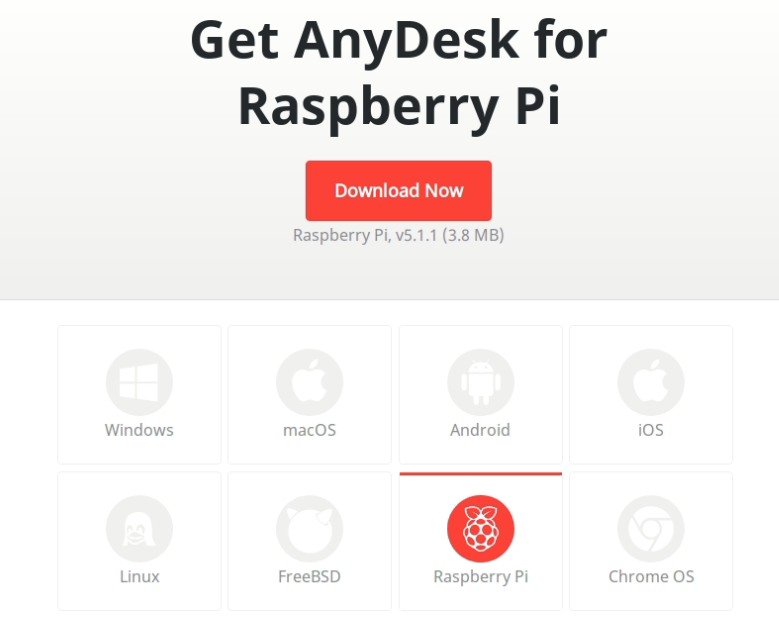

這樣設定就可以透過IP直接連入

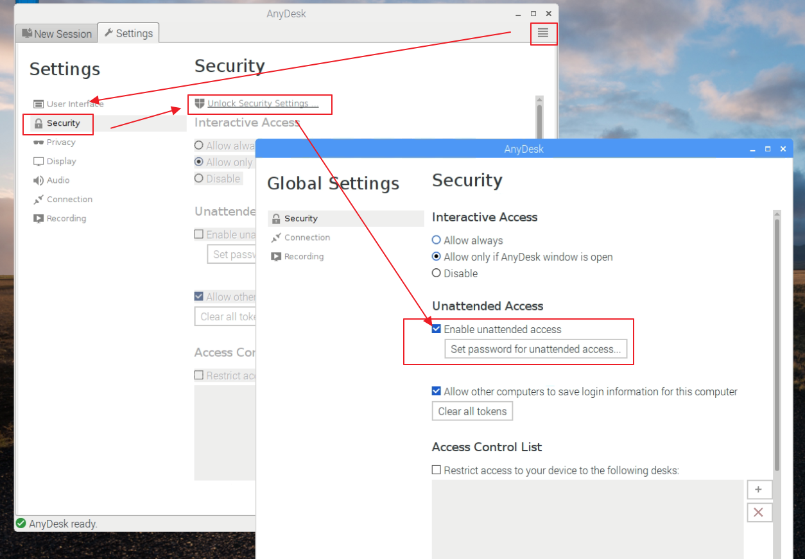

- 遠端螢幕好小怎麼辦

在沒有接上HDMI時，raspberry pi預設不會決定要使用甚麼解析度，它會自行偵測連接上來的螢幕的解析度，因此遠端連上會看到一個很小的螢幕。解決方法是在設定頁面指定一個解析度給raspberry pi。不要使用Default。

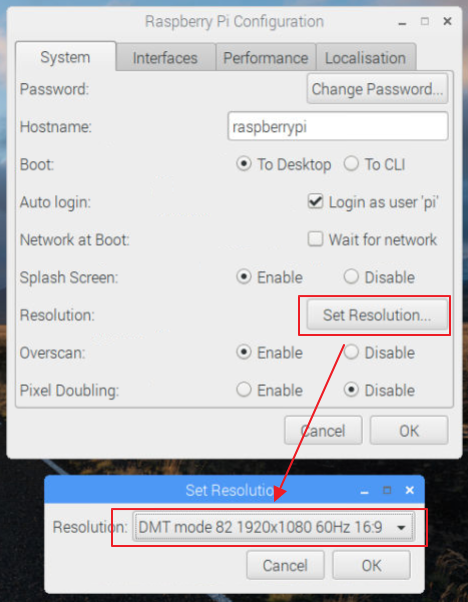

or

```shell
sudo raspi-config
--> 7 Advanced Options 
--> A5 Resolution 
```

### 如何將Raspberry Pi切換成無線基地台

我習慣用ubuntu的network manager GUI設定，透過apt安裝。raspberry pi內建的dhcpcd5與openresolv會影響到network manager運作所以先移除。

```shell
sudo apt install network-manager*
sudo apt purge dhcpcd5 
sudo apt purge openresolv 
reboot
```

network manager可以取代raspberry內建的網路管理器。

右鍵開啟設定

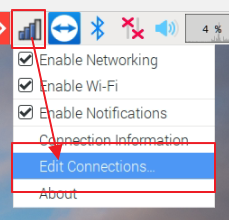

選擇Wi-Fi

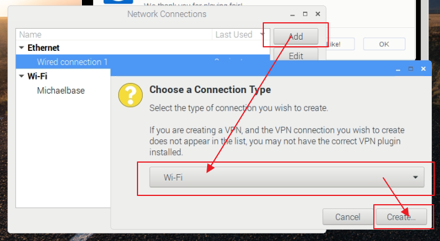

選擇Hotspot模式(AP mode)與要當作AP的無線網卡，這裡使用Raspberry Pi內建的無線網卡(wlan0)

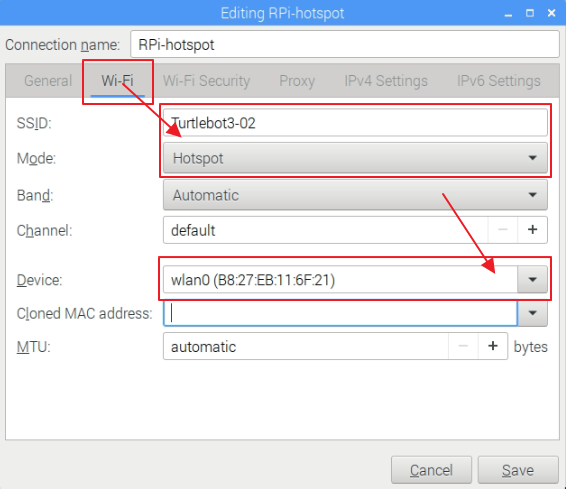

設定安全性

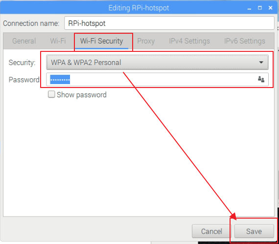

左鍵選擇建立連線

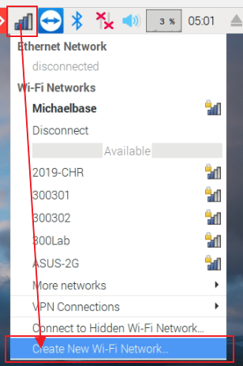

開啟熱點

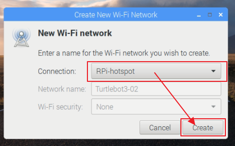

這樣就可以初始化成熱點了

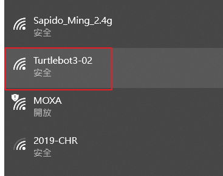

熱點預設會啟動DHCP，重開機預設都會用熱點啟動除非把設定檔刪除，AP的IP為**10.42.0.1**，至於會分配給設備什麼IP，就打ifconfig 或 ipconfig自行查詢吧!


### 製作.Desktop的方法

[how-can-i-create-launchers-on-my-desktop](https://askubuntu.com/questions/64222/how-can-i-create-launchers-on-my-desktop)

[an-easy-way-to-create-a-desktop-shortcut](https://askubuntu.com/questions/450266/an-easy-way-to-create-a-desktop-shortcut)

```shell
sudo apt-get install --no-install-recommends gnome-panel
gnome-desktop-item-edit --create-new ~/Desktop
```


### 開機執行程式

- 製作要執行的批次檔

```shell
# create an empty file
touch ~/run_leafpad.sh
  
# for a file containing the output "leafpad"
echo 'leafpad' > ~/run_leafpad.sh
  
# 執行的權限
chmod +x ~/run_leafpad.sh
```

- 製作該批次檔的捷徑(.desktop)，ln製作出來的軟硬連結是無效的

  參考製作.Desktop的方法

  ```shell
  gnome-desktop-item-edit --create-new ~/
  ```

  

  

- 將捷徑複製到~/.config/autostart

  ```shell
  cp ~/launch_leafpad.desktop ~/.config/autostart
  ```

- 重開機試試看效果

  

### 安裝Visual Studio Code

**還有問題**

[https://pimylifeup.com/raspberry-pi-visual-studio-code/](https://pimylifeup.com/raspberry-pi-visual-studio-code/)

```shell
wget https://packagecloud.io/headmelted/codebuilds/gpgkey -O - | sudo apt-key add -
curl -L https://code.headmelted.com/installers/apt.sh | sudo bash
```

接下來前往**startup menu-->Accessones-->Code - OSS**啟動VSCode 

-會黑黑的甚麼內容都沒有之後還要看看怎麼解決


# [Home](./Home.md)

