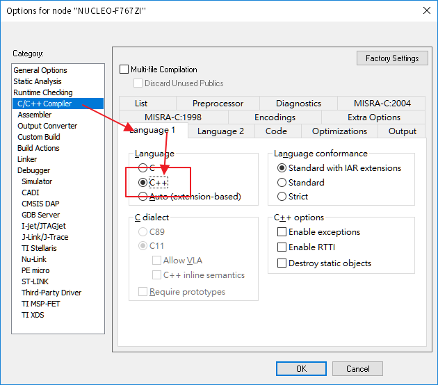
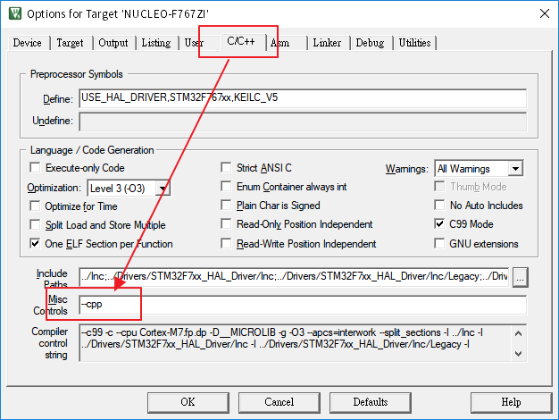
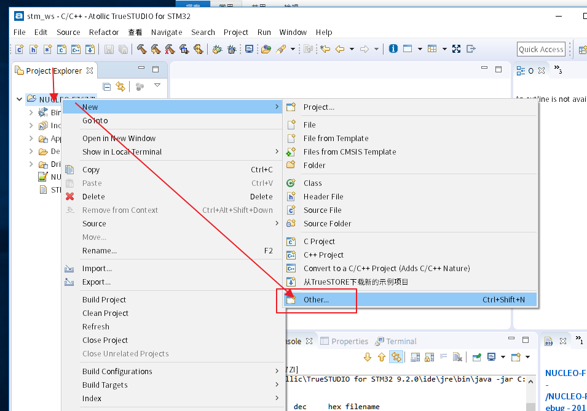
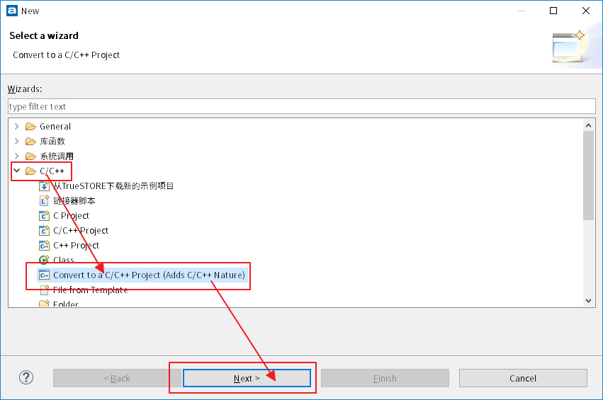
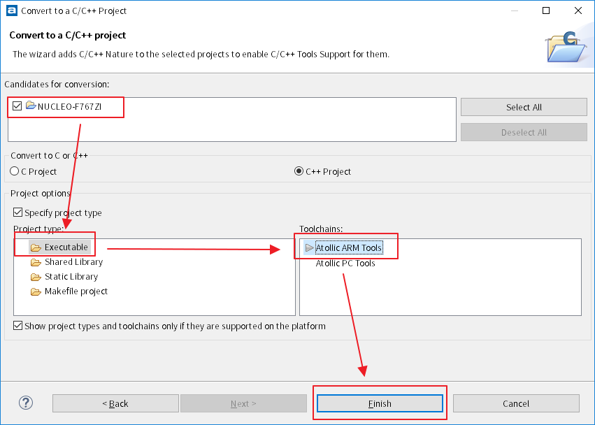
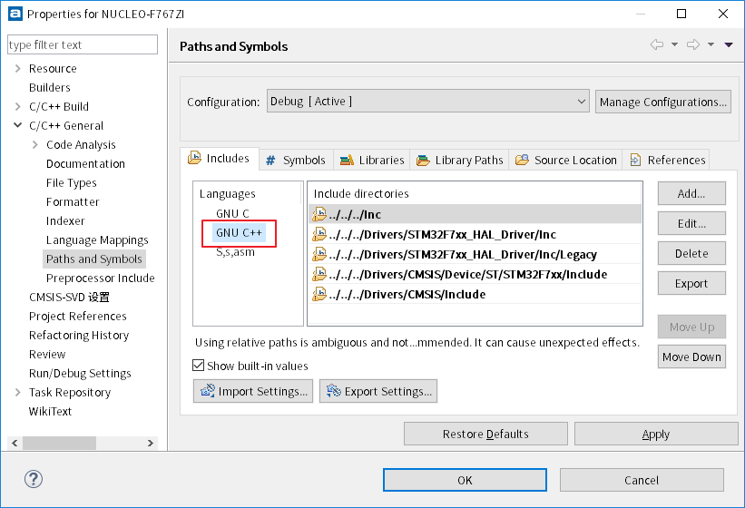
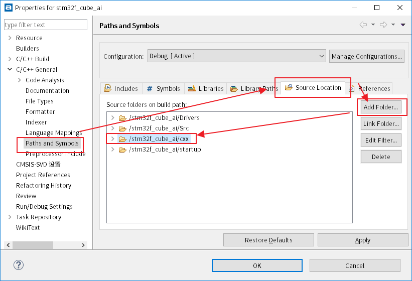
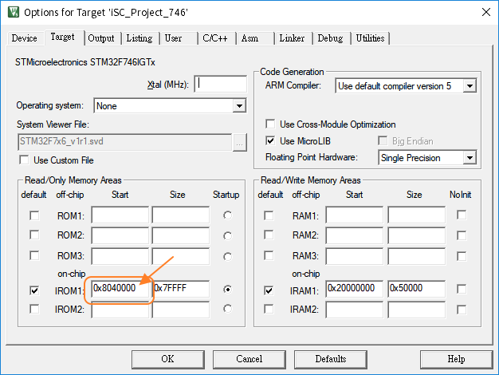
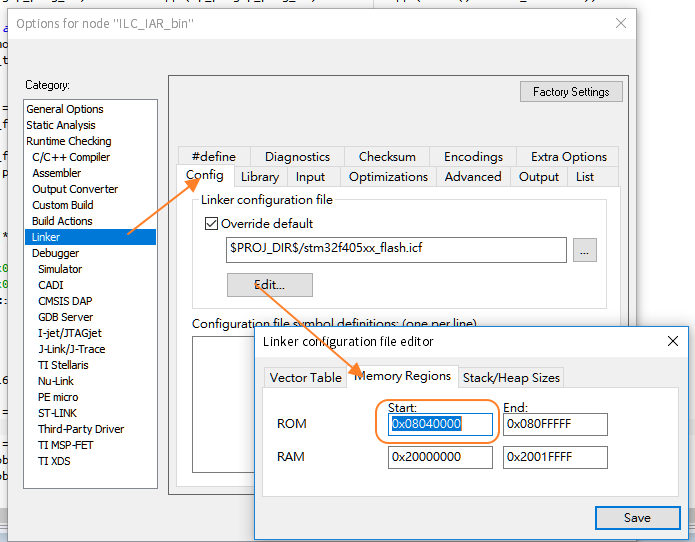

[TOC]


# STM32

## 在windwos透過makefile編譯出燒錄檔

- 開啟MXCube或*.ioc產生code
- 安裝make指令

```shell
choco install make
```

- 安裝arm的編譯環境

```shell
choco install gcc-arm-embedded
```

到這步就可以使用終端機make出燒錄檔

## TrueStudio (Eclipse)

### 習慣性的設定

- 習慣的visual studio code 的熱鍵 

  `工具列 Window -> Preferences -> General -> Keys -> Scheme -> Microsoft Visual Studio`

### printf的使用

- SWV (SWO) 看影片吧

  <https://www.youtube.com/watch?v=BwgPV3uKuzY>

  其實只要複寫掉

- printf 浮點數

  <https://www.twblogs.net/a/5cb8dec3bd9eee0eff45cb75>

  `工程名稱按右鍵->Property->C/C++ Build->Settings->ToolSettings->C Linker->Miscellaneous->Other options`

  打上`-u_printf_float`

### 最佳化設定

- `工程名稱按右鍵->Property->C/C++ Build->Settings->ToolSettings->C Compiler->Optimization->Optimization Level`

### 有關Include路徑的加入

- `直接到左邊的Project Explorer -> 對欲加入的資料夾按右鍵 -> add/remove include path `
- `或 工程名稱按右鍵->Property->C/C++ Build->Settings->ToolSettings->C Compiler->Directories`手動加入
- `或 工程名稱按右鍵->Property->C/C++ General->Paths and Symbols->Includes`手動加入

### 編譯產生bin檔(預設只有hex)

- <https://community.st.com/s/question/0D50X00009XkWfzSAF/how-to-generate-a-bin-file-in-atollic>
- `工程名稱按右鍵->Property->C/C++ Build->Settings->ToolSettings->Other->Output format->選擇Binary`

## Makefile (STM CubeMX 產出)

### printf的使用

- printf 浮點數

  <https://stackoverflow.com/questions/12703307/arm-none-eabi-gcc-printing-float-number-using-printf?rq=1>

```makefile
# LIBS = -lc -lm -lnosys 改成
LIBS = -lc -lm -lnosys -u _printf_float
```

## Toolchian/IDE For STM32 編譯c++的方法

我驗證的板子是NUCLEO F767ZI

### IAR (EWARM V7)

`project->option->C/C++ Compiler->Language 1->Language ->C++`如圖切換



### KeilC v5 (MDK-ARM v5)

`Project->Option for Target'xxxx'->C/C++->Misc Controls->增加--cpp`如圖



### TrueSTUDIO

先轉換專案成C++專案

`Project Explorer->欲轉換的專案右鍵->New->Other..->C/C++->Convert to a C/C++ Project (Adds C/C++ Nature)`







之後就會多出GNU C++的編譯環境如圖



如果c++的檔案路徑不是放在預設的Src路徑之中，記得要到這裡維護Src的路徑。



這樣TrueSTUDIO在編譯時只要看到副檔名是.cpp的檔案就會使用g++編譯，.c照舊使用gcc編譯。

- 目前還是沒有找到.c的檔案中，包含c++風格的程式可以編譯的方法，所以一定要在.cpp的檔案中使用c++的程式。

### MakeFile

增加`C++ sources`

```makefile
# C++ sources
CXX_SOURCES = \
src_cxx/cxx_main.cpp \
src_cxx/my_class.cpp
```

增加編譯c++的g++工具

```makefile
ifdef GCC_PATH
CC = $(GCC_PATH)/$(PREFIX)gcc
CXX = $(GCC_PATH)/$(PREFIX)g++ #add
AS = $(GCC_PATH)/$(PREFIX)gcc -x assembler-with-cpp
CP = $(GCC_PATH)/$(PREFIX)objcopy
SZ = $(GCC_PATH)/$(PREFIX)size
else
CC = $(PREFIX)gcc
CXX = $(PREFIX)g++ #add
AS = $(PREFIX)gcc -x assembler-with-cpp
CP = $(PREFIX)objcopy
SZ = $(PREFIX)size
endif
```

增加`includes`目錄

```makefile
# C includes
C_INCLUDES =  \
-IInc \
-IDrivers/STM32F7xx_HAL_Driver/Inc \
-IDrivers/STM32F7xx_HAL_Driver/Inc/Legacy \
-IDrivers/CMSIS/Device/ST/STM32F7xx/Include \
-IDrivers/CMSIS/Include \
-Isrc_cxx #add
```

CFLAGS後面增加CXXFGLAGS

```makefile
CXXFLAGS = -lstdc++ $(CFLAGS) $(CXX_DEFS) $(C_INCLUDES) -g -ggdb3 -fno-rtti -fno-exceptions \
-fverbose-asm -fdata-sections -ffunction-sections -fpermissive -Wa,-ahlms=$(BUILD_DIR)/$(notdir $(<:.cpp=.lst))
```

增加C++的編譯選項

```makefile
# list of c++ objects
OBJECTS += $(addprefix $(BUILD_DIR)/,$(notdir $(CXX_SOURCES:.cpp=.o)))
vpath %.cpp $(sort $(dir $(CXX_SOURCES)))
```

還有

```makefile
$(BUILD_DIR)/%.o: %.cpp Makefile | $(BUILD_DIR) 
	$(CXX) -c $(CXXFLAGS) $< -o $@
```

完成

這樣就可以使用makefile編譯c++的程式

## 程式啟動的位置如何調整

一般都是在0x8000000的位置，但是有Bootloader(0x8000000)與application(0x8040000)架構的韌體時，就會需要調整app的啟動位置，編譯出來的燒錄檔才會有對應的變化。

### KeilC v5 (MDK-ARM v5)

`Project -> Option for Target XXX -> Target -> IROM -> Start`



### IAR (EWARM V7)

`Project -> Option -> Linker-> Config -> Linker configuration file -> Edit... `



### TrueSTUDIO & MakeFile

直接到附檔名是`.ld`的檔案中修改`MEMORY->FLASH的部分`

```asm
MEMORY
{
RAM (xrw)      : ORIGIN = 0x20000000, LENGTH = 512K
FLASH (rx)      : ORIGIN = 0x8040000, LENGTH = 1024K
}
```

## stm32的範例程式要到哪裡找呢

如果有STM32CubeMX，並且也下載過對應的pack了，可以到以下路徑去找

```
C:\Users\<USERNAME>\STM32Cube\Repository\
```

# [Home](./Home.md)