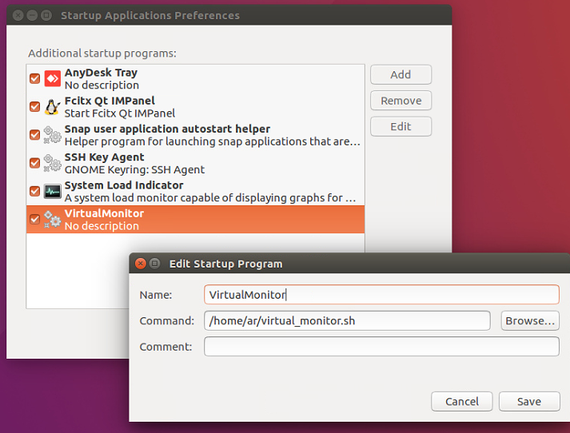
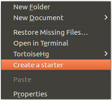
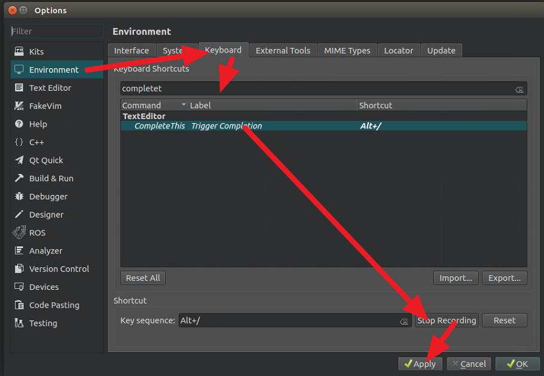
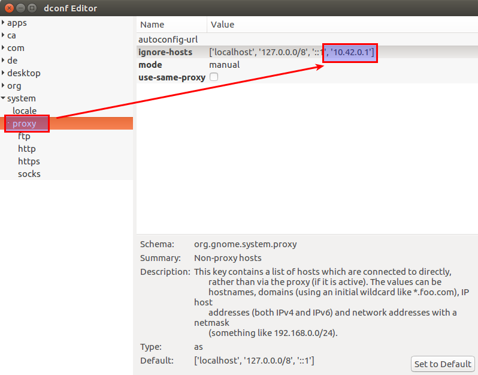
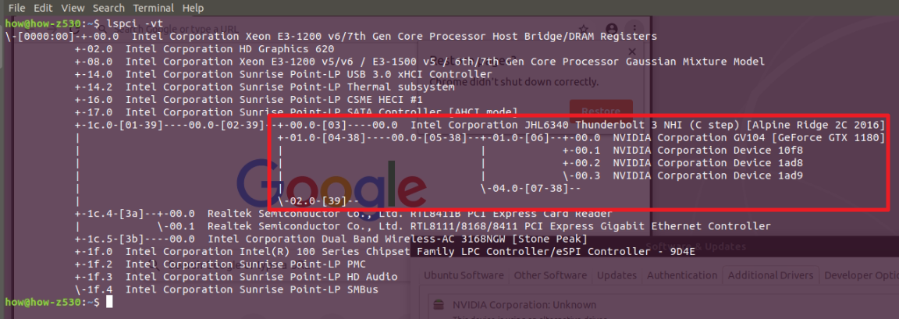

[TOC]

# Ubuntu

### 沒有接螢幕的情況下遠端桌面的怪問題

ref:

https://askubuntu.com/questions/453109/add-fake-display-when-no-monitor-is-plugged-in?newreg=e870bc337fef4f31835e69c70ff6557e

https://unix.stackexchange.com/questions/378373/add-virtual-output-to-xorg

- 建立虛擬的螢幕的接口

建立檔案 `/usr/share/X11/xorg.conf.d/20-intel.conf `檔案內容為

```shell
Section "Device"
    Identifier "intelgpu0"
    Driver "intel"
    Option "VirtualHeads" "2"
EndSection
```

- 建立一個批次檔`~/virtual_monitor.sh`利用xrandr指令告知這個接口虛擬螢幕的顯示參數

這些訊息可以輸入 `cvt 1920 1080`來取得

```shell
#!/bin/bash

xrandr --newmode "1920x1080_60.00" 173.00  1920 2048 2248 2576  1080 1083 1088 1120 -hsync +vsync
xrandr --addmode VIRTUAL1 "1920x1080_60.00"
xrandr
```

- #### 開機時執行這個批次檔

例如 Startup Application:



### 如何使用NetworkManagers設定hotspot改變分配的IP

https://askubuntu.com/questions/844913/how-to-control-ip-ranges-of-network-managers-hotspots

首先到這個路徑找出使用的網路配置檔，利用sudo開啟

```shell
cd /etc/NetworkManager/system-connections
sudo gedit <config_file>
```

編輯**[ipv4]**這個區域增加**address1**後保存

```shell
[ipv4]
dns-search=
method=shared
address1=192.168.10.1/24,192.168.10.1
```

重啟服務

```shell
sudo service network-manager restart
```

### 要怎麼知道hotspot有多少設備連上來

```shell
arp -an
```

### 製作桌面捷徑的方法

https://askubuntu.com/questions/64222/how-can-i-create-launchers-on-my-desktop

http://ubuntuhandbook.org/index.php/2019/05/arronax-graphical-tool-create-desktop-launcher-in-ubuntu/

這邊採用Arronax的方法

```shell
sudo add-apt-repository ppa:diesch/stable
sudo apt update
sudo apt install arronax-nautilus
nautilus -q
```

這樣右鍵的選單就會多出Create a starter的選項，可以利用他叫出工具來。




https://askubuntu.com/questions/47775/how-can-i-set-the-path-variable-in-a-desktop-file-to-be-relative-to-the-locat

### QT 要怎麼輸入中文

解決方法

```shell
#尋找libfcitxplatforminputcontextplugin.so的位置
sudo apt-get install fcitx-frontend-qt5
dpkg -L fcitx-frontend-qt5

#/usr/lib/x86_64-linux-gnu/qt5/plugins/platforminputcontexts/libfcitxplatforminputcontextplugin.so
```

將這個.so複製到QT安裝的位置中platforminputcontexts的資料夾當中

```shell
# 找到名為 platforminputcontexts的 資料夾
find / -name platforminputcontexts -type d 2> >(grep -v 'Permission denied' >&2)
```

```shell
#ex:
#/usr/lib/x86_64-linux-gnu/qt5/plugins/platforminputcontexts
#/home/how/QtCreator/latest/lib/Qt/plugins/platforminputcontexts

將 libfcitxplatforminputcontextplugin.so複製進去
cp /usr/lib/x86_64-linux-gnu/qt5/plugins/platforminputcontexts/libfcitxplatforminputcontextplugin.so /home/how/QtCreator/latest/lib/Qt/plugins/platforminputcontexts/
```

### QT的自動完成快速鍵

預設是ctrl + space會與輸入法的切換衝突。所以我把它換成alt + /

`工具列->Tools->Options->Environment->Keyboard`



### Beyond compare 4 的安裝與破解

https://www.cnblogs.com/bluestorm/p/10259441.html

https://gist.github.com/satish-setty/04e1058d3043f4d10e2d52feebe135e8

去[官方網站](http://www.scootersoftware.com/download.php)下載，我載這個[Debian](http://www.scootersoftware.com/bcompare-4.2.10.23938_amd64.deb)。

```shell
# 安裝
cd ~/Downloads/
sudo dpkg -i bcompare*
```

```shell
# First delete away trial mode:
sudo sed -i "s/keexjEP3t4Mue23hrnuPtY4TdcsqNiJL-5174TsUdLmJSIXKfG2NGPwBL6vnRPddT7tH29qpkneX63DO9ECSPE9rzY1zhThHERg8lHM9IBFT+rVuiY823aQJuqzxCKIE1bcDqM4wgW01FH6oCBP1G4ub01xmb4BGSUG6ZrjxWHJyNLyIlGvOhoY2HAYzEtzYGwxFZn2JZ66o4RONkXjX0DF9EzsdUef3UAS+JQ+fCYReLawdjEe6tXCv88GKaaPKWxCeaUL9PejICQgRQOLGOZtZQkLgAelrOtehxz5ANOOqCaJgy2mJLQVLM5SJ9Dli909c5ybvEhVmIC0dc9dWH+/N9KmiLVlKMU7RJqnE+WXEEPI1SgglmfmLc1yVH7dqBb9ehOoKG9UE+HAE1YvH1XX2XVGeEqYUY-Tsk7YBTz0WpSpoYyPgx6Iki5KLtQ5G-aKP9eysnkuOAkrvHU8bLbGtZteGwJarev03PhfCioJL4OSqsmQGEvDbHFEbNl1qJtdwEriR+VNZts9vNNLk7UGfeNwIiqpxjk4Mn09nmSd8FhM4ifvcaIbNCRoMPGl6KU12iseSe+w+1kFsLhX+OhQM8WXcWV10cGqBzQE9OqOLUcg9n0krrR3KrohstS9smTwEx9olyLYppvC0p5i7dAx2deWvM1ZxKNs0BvcXGukR+/g" /usr/lib/beyondcompare/BCompare
```

重啟Beyond Compare之後輸入 License

```shell
--- BEGIN LICENSE KEY ---
ayvZeJDYPBHS4J-1K6g6bDBuPoo0G-oGAq35blZtAoRqC-qQeSz28XAzX
6nTx9laTMLRCp6nAIhHNGZ2ehkeUfbnFaxEeLvI8fJavn-XQLNbOumCLU
qgdNbNMZiFRU03+OTQnw4V-E2YKTYi-LkgPzE6R-yIJGDNWfxH2AdpIgg
8rlpsbrTs9Dt1zysUfvAEi0dKbmGIi3rqf7yWmwDh1AI5VyoWFIejvJwJ
Lmlr2CjQ1VZ3DySCfBDuKcYmOCeK7jzEWPUnAw+f9360nIiiNEB0YGkwB
kdtgaKEEik7aNiI3jXvp5r34wViVJCiX7m2y7pqBV9gZIvP9hP9KPnP++++
--- END LICENSE KEY -----
```

### 備份整個sd卡的方法

<https://askubuntu.com/questions/227924/sd-card-cloning-using-the-dd-command>

首利用`fdisk -l`找出sd卡的路徑 例如**/dev/mmcblk0**

```shell
# 卸除
sudo umount /dev/mmcblk0
# 複製sd卡內容成為img（需要等待一段時間）
sudo dd if=/dev/mmcblk0 of=~/sd-card-copy.img
```

插入另外要寫入的sd卡，同樣使用`fdisk -l`找出sd卡的路徑 例如**/dev/mmcblk1**

```shell
# 卸除
sudo umount /dev/mmcblk1
# 將img寫入sd卡
sudo dd if=~/sd-card-copy.img of=/dev/mmcblk1
```

### 掛代理之後要忽略特定的ip

<http://ask.xmodulo.com/add-proxy-exceptions-ubuntu-desktop.html>

利用`dconf-editor`gui

```shell
# 安裝
sudo apt-get install dconf-editor
dconf-editor
```



在這個欄位增加需要忽略的ip


### 顯示卡外接盒

先插上USB type C 看看能不能偵測的到。

```shell
lspci -vt
```

可以看到很多關於PCI-E 裝置的訊息，Thunderbolt3 的type C接頭也會是PCIE的設備，支援熱插拔。


看起來ubuntu18.04才能抓到顯卡




### 安裝 Nvidia 顯卡的驅動程式

https://www.cyberciti.biz/faq/ubuntu-linux-install-nvidia-driver-latest-proprietary-driver/

[https://medium.com/@grady1006/ubuntu-16-04-%E5%92%8C18-04%E5%AE%89%E8%A3%9D%E5%A4%96%E6%8E%A5%E9%A1%AF%E5%8D%A1%E9%A9%85%E5%8B%95%E5%90%84%E7%A8%AE%E5%9D%91%E8%88%87%E6%B3%A8%E6%84%8F%E4%BA%8B%E9%A0%85-6a1eca2c738f](https://medium.com/@grady1006/ubuntu-16-04-和18-04安裝外接顯卡驅動各種坑與注意事項-6a1eca2c738f)

https://blog.csdn.net/tjuyanming/article/details/80862290

https://egpu.io/forums/thunderbolt-linux-setup/egpu-in-blender-18-04-works-flawlessly/

```shell
# 顯卡設定頁面
nvidia-settings
# 顯卡訊息
nvidia-smi 
```

燒機程式

https://blog.gtwang.org/linux/linux-nvidia-gpu-benchmarking-and-stress-testing/

https://stackoverflow.com/questions/46064433/cuda-home-path-for-tensorflow

奇怪的錯誤

```shell
The following packages have unmet dependencies:
 nvidia-cuda-toolkit : Depends: nvidia-cuda-dev (= 9.1.85-3ubuntu1) but it is not going to be installed
E: Unmet dependencies. Try 'apt --fix-broken install' with no packages (or specify a solution).
```

**sudo apt-get -o Dpkg::Options::="--force-overwrite" install --fix-broken**

### CUDA

https://developer.nvidia.com/cuda-downloads

https://stackoverflow.com/questions/46064433/cuda-home-path-for-tensorflow


### 18.04 的右鍵建立空白檔案不見了?

```
touch ~/Templates/"Untitled Document"
```

# [Home](./Home.md)


